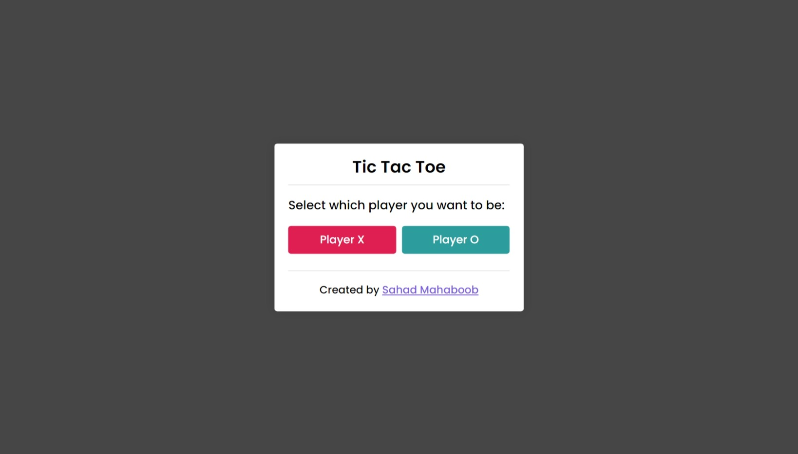

    

<h1 align = "center"><b>Tic-Tac-Toe</b></h1>

Tic Tac Toe game built with HTML, CSS and JavaScript

    <a href="https://tic-tac-toe-sahadcmd.vercel.app/" target="_blank">Visit Website</a>
    ·
    <a href="https://github.com/sahadcmd/Tic-Tac-Toe/issues" target="_blank">Report Bug</a>

## About this project 🚀

Upon selecting X or O, the playboard appears. Player names indicate turns. Clicking a box reveals the selected character. After each move, the bot selects an unchosen box. When someone wins, the result box displays the winner with a replay button. If all boxes are selected without a winner, it's a draw. Clicking replay reloads the page for another game.

## Technologies 🛠️

* `HTML5`
* `CSS3`
* `JavaScript`

## How it looks 📷

    

<h5 align="center">Connect with me!</h5>

    <a href="https://www.linkedin.com/in/sahadmahaboobp" target="_blank">LinkedIn</a>

